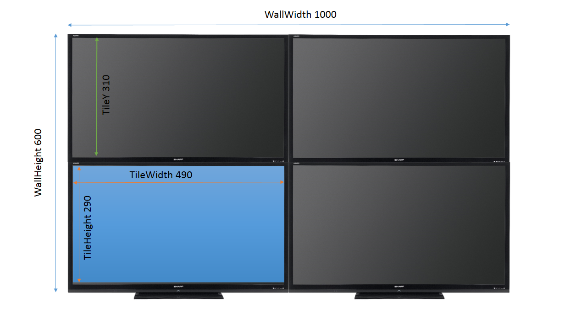

#SyncVideoPi
Ce projet a pour but de fournir un système multi-écran basé sur des raspberry PI. Chaque raspberry est relié à un écran et affiche seulement la partie correspondant à sa position dans la géométrie globale du mur d'écran.

##Comment utiliser
Pour utiliser ce programme, il faut passer par plusieurs étapes. Le système utiliser le réseau pour distribuer le programme et les médias. La première étape consiste donc à configurer le réseau. Le système repose sur la synchronisation temporelle, il faut donc installer et configurer NTP sur les raspberry. Le partage des médias est basé sur NFS, il faut donc le configurer. La dernière étape consiste à installer le programme en lui même et à le configurer.

###Le réseau

###NTP

###NFS


###Le programme
####L'installation
Pour installer le programme, cloner le dépôt github, copier le dossier *install/* sur chacun des raspberry. Exécuter ensuite ensuite le script *install.sh* avec les droits d'administrateur. 


```scp -r install/ pi@piaddress:/home/pi/```

Sur les raspberry:
*```cd /home/pi/install```
*```sudo ./install.sh```

####Utilisation
*Configuration géométrie
Une fois le programme installer sur chacun des raspberry, il faut configurer la gémoétrie. Pour chacun des écrans, il faut mesurer leur taille et leur position dans le mur. Il faut également connaître la taille du mur d'acran. il faut créer un fichier texte suivant l'exemple ci-dessous.

```
wallWidth       1005
wallHeight      610

tileWidth       475
tileHeight      300

tileX   0
tileY   310

```

*Configuration programmation
Pour indiquer à quelle heure les médias doivent s'afficher sur le mur d'écran, il faut indiquer le résultat attendu dans un fichier texte respectant ce format. 

```
VIDEO NFS_Folder/video.mp4 2014/02/08/19:00:00 2014/02/08/20:59:00 NO_LOOP
VIDEO NFS_Folder/video2.mov 2014/02/08/20:59:00 2014/02/08/22:00:00 LOOP
IMAGE NFS_Folder/image.png 2014/02/08/22:00:00 2014/02/08/23:00:00
```
Le fichier ci-dessus indique que le média *vidéo.mp4* doit être afficher sur les écrans entre 19h et 20h59 le 8 février 2014 et que la vidéo ne doit pas reprendre au début si elle est finie. Viendra ensuite la vidéo2.mov qui elle sera lue en boucle et enfin l'image qui sera affichée entre 22h er 23h. Comme le programme doit être commun à tous les raspberry, il est préférable de le mettre sur le dossier NFS partagé.

*Lancement
Une fois tout configurer, il ne reste plus qu'a exécuter le programme sur tous les raspberry.
```videosync configScreen.cf programm.pr```

##Comment compiler

